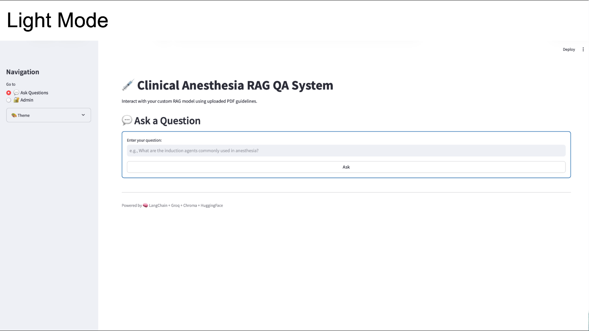
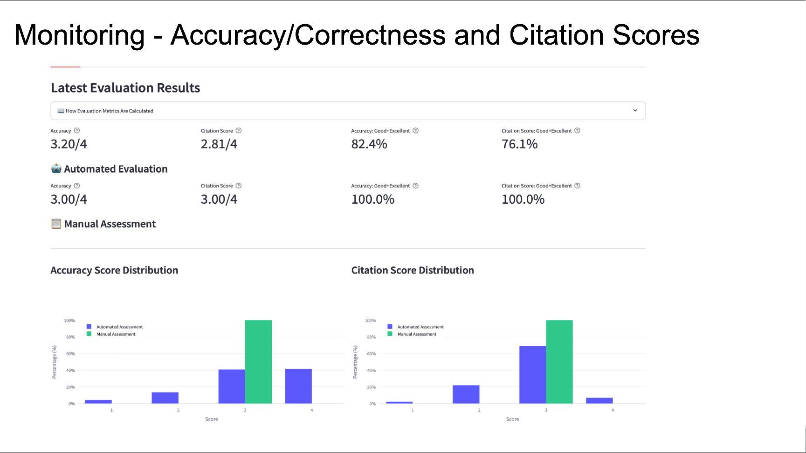

# Clinical-Anesthesia-QA-System-using-RAG-and-LLMs
An AI assistant for anesthesia knoweldge using retrieval-augmented generation and LLMs to answer clinical questions



## Admin Page

- Start API: 
  - **Recommended:** `./start_server.sh` (excludes .venv and other non-source files from watching)
  - **Or manually:** `uvicorn app.main:app --reload --reload-exclude '.venv/*' --reload-exclude '__pycache__/*'`
- Open admin: `http://127.0.0.1:8000/admin`
  - Monitor evaluation status (auto-refreshes every 2s)
  - Trigger evaluations
  - Upload PDFs to `data/pdfs`

Optional automatic PDF→Markdown conversion:

```
export ENABLE_PDF_CONVERSION=true
export OPENAI_API_KEY=your_key
```

If not enabled, run your own PDF watcher or converter (e.g., `watchmedo` with `app/extract_pdf_to_markdown.py`) so that saved PDFs are converted into Markdown in `data/ingested_documents`, which then triggers the DB rebuild via the existing watcher.

## Docker Deployment

### Prerequisites
- Docker Desktop installed and running
- Docker Compose installed (included with Docker Desktop)

### Setup

1. **Create environment file:**
   ```bash
   cp sample.env .env
   ```
   Edit `.env` with your actual API keys and configuration values.

2. **Test Docker builds:**
   ```bash
   ./test_docker.sh
   ```
   This script will:
   - Verify Docker is running
   - Build backend and frontend images
   - Test container startup
   - Verify docker-compose build

3. **Start all services:**
   ```bash
   docker-compose up --build
   ```
   Or run in detached mode:
   ```bash
   docker-compose up -d
   ```

### Services

The Docker setup includes four services:

- **backend** (port 8000): FastAPI backend service
  - Health check: `http://localhost:8000/health`
  - API docs: `http://localhost:8000/docs`
  - Admin page: `http://localhost:8000/admin`

- **frontend** (port 8501): Streamlit frontend
  - Access at: `http://localhost:8501`

- **watcher**: Monitors markdown files and rebuilds the database
  - Runs in background, automatically restarts on failure

- **pdf_watcher**: Monitors PDF files and converts them to markdown
  - Runs in background, automatically restarts on failure

### Data Persistence

Data directories are mounted as volumes for persistence:
- `data/ingested_documents/`: Markdown files (converted from PDFs)
- `data/chroma_db/`: ChromaDB vector database
- `data/pdfs/`: PDF files for processing
- `uploads/`: Temporary uploaded files

These directories persist on the host machine, so data survives container restarts.

### Viewing Logs

```bash
# View all logs
docker-compose logs -f

# View specific service logs
docker-compose logs -f backend
docker-compose logs -f frontend
docker-compose logs -f watcher
docker-compose logs -f pdf_watcher
```

### Stopping Services

```bash
# Stop all services
docker-compose down

# Stop and remove volumes (WARNING: deletes data)
docker-compose down -v
```

### Troubleshooting

- **Build fails**: Check that `.env` file exists and contains required values
- **Container exits immediately**: Check logs with `docker-compose logs <service-name>`
- **Port conflicts**: Modify port mappings in `docker-compose.yml` if ports 8000 or 8501 are in use
- **Permission errors**: Ensure Docker has access to mounted directories
- **401 Unauthorized error for embedding model**: 
  - Some models (e.g., `NeuML/pubmedbert-base-embeddings`) require a valid `HF_TOKEN`
  - Set `HF_TOKEN` in your `.env` file with a token from https://huggingface.co/settings/tokens
  - General purpose models like `all-MiniLM-L6-v2` don't require authentication
- **Embedding model not found**: 
  - Check that `EMBEDDING_MODEL` in `.env` doesn't have quotes around it
  - The model name should be: `NeuML/pubmedbert-base-embeddings` (not `'NeuML/pubmedbert-base-embeddings'`)

## Watchers (Quiet Period Flow)

To achieve: Upload PDF → (quiet A) → Convert to .md → (quiet B) → Rebuild DB

1) PDF Watcher (waits, then converts):
```
export PDF_WATCH_DIRECTORY=./data/pdfs
export MD_OUTPUT_DIR=./data/ingested_documents
export PDF_QUIET_PERIOD_SECONDS=120
python3 app/pdf_watcher.py
```

2) Database Watcher (waits, then rebuilds DB):
```
export WATCH_DIRECTORY=./data/ingested_documents
export MARKDOWN_DIR=./data/ingested_documents
export DB_DIR=./data/chroma_db
export QUIET_PERIOD_SECONDS=300
python3 app/database_watcher.py
```

Notes:
- Run both watchers to chain conversion then rebuild.
- In Docker, mount `/app/data` for persistence.
The goal is to make an intelligent system that could help an anesthesiologist ask clinical questions and retrieve accurate and context aware answers.
---

## Project Overview
-Collect anesthesia-related documents as knoweldge base.  
-Use a **retriever** to fetch relevant document chunks.

### Screenshots




---

## Tech Stack
-**Python**  
-**LangChain / LlamaIndex** (for RAG pipeline)

--
